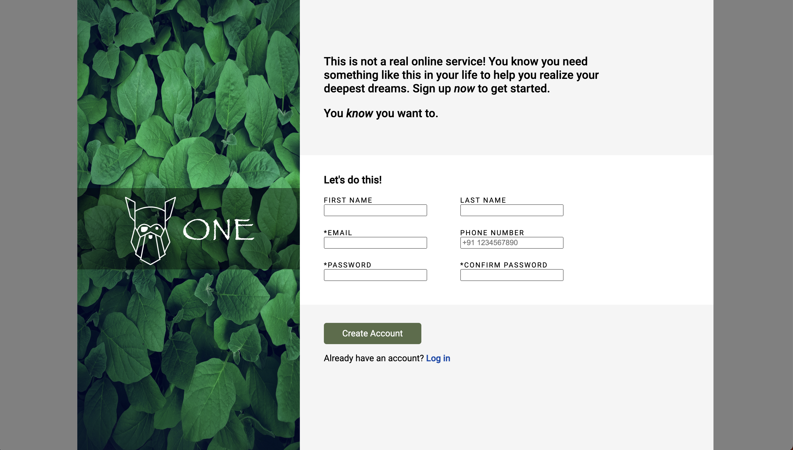
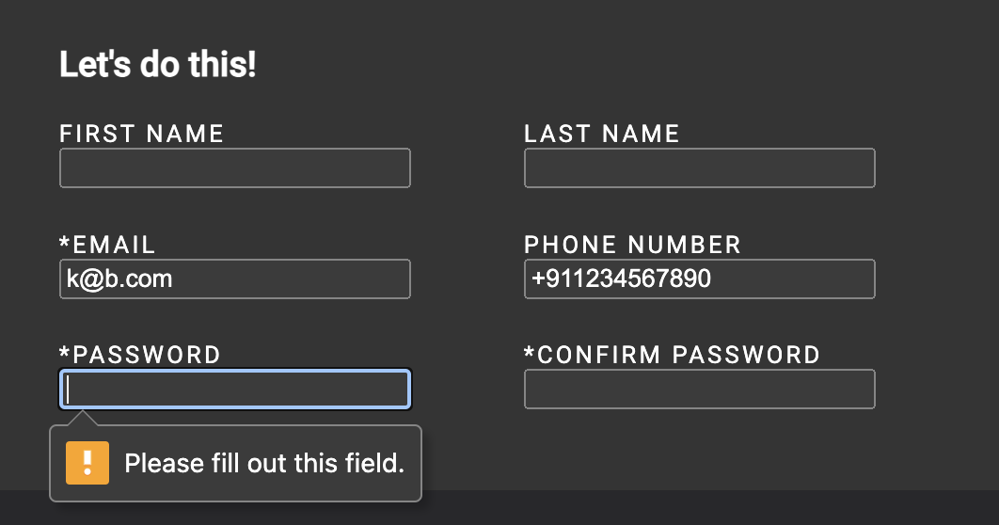

## Sign-Up Home Page
This project creates a dummy sign-up home page for a website.
[](#table-of-contents)

## Overview:

<ul>
    <li>Supports both Light & Dark mode based on user preference (automatic).</li>
    <li>Design also supports mobile devices (in portrait mode).</li>
    <li>Only standard units are used: rem, vh, vw to improve design.</li>
    <li>Form validations have been added for fields: Email, Password, Phone Number.</li>
    <li>Image is superimposed in the left banner using Absolute positioning.</li>
</ul>

[](#table-of-contents)

## Project Files:
<ul>
    <li><b>index.html:</b> the html tags, DOM setup and related meta information</li>
    <li><b>style.css:</b> details for layout, @media queries, etc</li>
    <li><b>ReadMe:</b> this document</li>
    <li><b>.gitignore:</b> file setup to ignore Mac system files on local machine</li>
    <li><b>root/images:</b> the icon, and images used in the ReadMe document</li>
</ul>

[](#table-of-contents)

## The below images show how the website looks on laptop/mobile in light/dark modes:



##


##


##


[]

## The below images show the validations in the input form:


##


##



[](#table-of-contents)

## Revised through this project:
<ul>
    <li>@media queries for dark/light mode, different screen sizes</li>
    <li>Forms (input, form validations)</li>
    <li>Importing external fonts (Google font)</li>
    <li>Absolute positioning</li>
    <li>Special selectors (">" for child elements). Ex: <u><em>#formContainer > input</em></u></li>
</ul>

[](#table-of-contents)

```css
@media (prefers-color-scheme: dark) {
    :root {
        color-scheme: dark;
    }
    #container {
        background-color: black !important;
    }
    #introPara, #bottomContainer, #container {
        background-color: rgb(40, 40, 43);
    }
    #middleSection {
        background-color: 	rgb(52, 52, 52);
    }
}
```